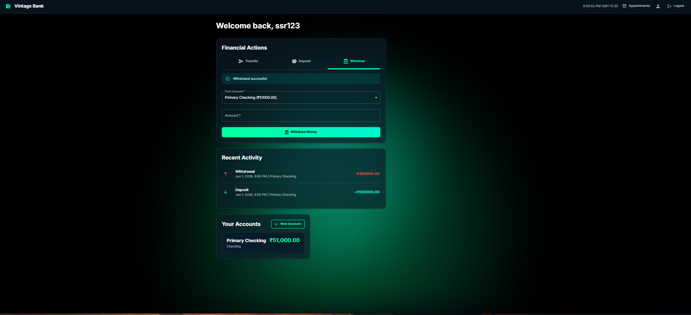
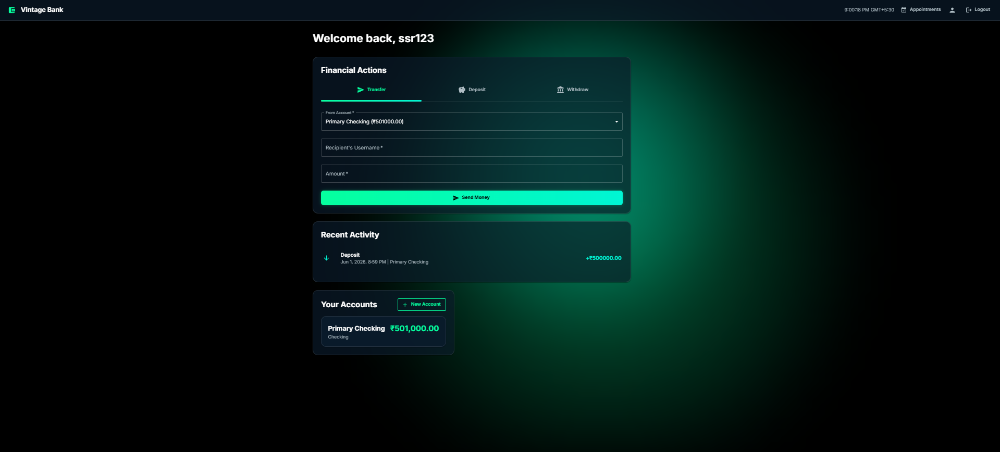
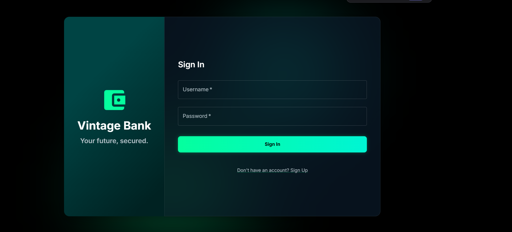

<div align="center">
  
# 🏦 Modern Full-Stack Bank Application

**A robust, secure, and beautiful banking dashboard built with React, Node.js, Express, and SQLite.**

[]()
[]()
[]()
[]()
[]()

</div>

---

## 🌟 Overview

This project is a comprehensive banking web application designed to simulate a real-world financial dashboard. It provides users with a seamless experience to manage their accounts, perform transactions (deposits, withdrawals, and user-to-user transfers), and schedule appointments, all secured with JWT authentication and password hashing.

---

## 📸 Screenshots

*(Instructions: Take screenshots of your running app, name them as shown below, place them in a folder called `assets` at the root of your repo, and push them to GitHub. They will automatically appear here!)*

### 1. User Dashboard

> *The main dashboard where users can view their total balance, active accounts, and a list of their recent transactions.*

### 2. Money Transfers & Transactions

> *The transaction interface allowing instant deposits, withdrawals, and peer-to-peer money transfers between platform users.*

### 3. Secure Authentication

> *A sleek login and registration portal featuring secure password hashing and JWT token generation.*

---

## ✨ Key Features

- **🔐 Secure Authentication:** End-to-end secure login and registration utilizing `bcryptjs` for password hashing and `jsonwebtoken` (JWT) for secure, stateless session management.
- **📊 Interactive Dashboard:** A dynamic React-based frontend providing a real-time overview of financial health, account balances, and recent activity.
- **💸 Real-time Transactions:** Robust backend logic allowing users to deposit funds, withdraw money safely with balance checks, and instantly transfer funds to other registered users.
- **🗂️ Account Management:** Users can open multiple accounts (e.g., Checking, Savings) within their single master profile.
- **📅 Appointment Scheduling:** Integrated appointment booking system for users to schedule in-branch or virtual meetings with banking staff.

---

## 🚀 Live Demo

- **Frontend:** https://bank-app-1-wvqh.onrender.com
- **Backend API:** https://bank-app-y7zu.onrender.com

---

## 💻 Tech Stack

### Frontend (Client-side)
* **Framework:** React 19
* **UI Component Library:** Material UI (MUI) v7
* **Styling:** Emotion & Custom CSS (Glassmorphism design)
* **Routing:** React Router v7
* **HTTP Client:** Axios

### Backend (Server-side)
* **Runtime:** Node.js
* **Framework:** Express.js
* **Database:** SQLite
* **Authentication:** JSON Web Tokens (JWT)
* **Security:** bcryptjs (Password Hashing), CORS

---

## 🛠️ Local Development Setup

To run this project on your local machine, follow these steps:

### Prerequisites
- Node.js (v14 or higher)
- npm or yarn

### 1. Backend Setup
```bash
cd backend
npm install
npm start
```
*The backend server will start on `http://localhost:3001`.*

### 2. Frontend Setup
Open a new terminal window:
```bash
cd bank-frontend
npm install
npm start
```
*The frontend will automatically open in your browser at `http://localhost:3000`.*

---

## 🌐 Deployment

This application is configured for easy deployment on platforms like Render, Vercel, or Heroku. 
- The backend requires the `PORT` and `JWT_SECRET` environment variables.
- The frontend requires the `REACT_APP_API_URL` environment variable pointing to your deployed backend.

---

<div align="center">
  <i>Developed with ❤️ by [Ssr446]</i>
</div>
